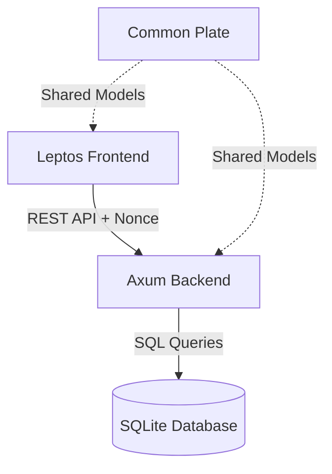

# Architectural Design Document: Fund Transparency

**Project Purpose**: A fundraising portal for community projects emphasizing auditability and spending transparency. For every donation, a donor should be able to see the exact expense it contributed to and view the corresponding receipt.

## 1. High-Level Architecture

The platform follows a standard client-server architecture with a shared common library for type safety.

### 1a. Components:
- **Backend (Rust/Axum)**: Stateless API server handling authentication, business logic, and database persistence.
- **Frontend (Rust/Leptos)**: WebAssembly (WASM) application providing the user interface for donors, project managers, and finance reviewers.
- **Database (SQLite 3)**: Persistent structured storage for users, projects, donations, and expenses.

## 2. Security & Data Privacy

### 2a. Authentication & Roles:
- **Supporter**: The default role for new users. Can donate, comment, and favorite projects.
- **Project Manager**: Can create projects, post updates, and record expenses.
- **Finance Reviewer**: Responsible for approving/rejecting expense disclosures and refunds.
- **Administrator**: Full system access, including role management and global settings.

### 2b. Privacy Model:
- **Immutable Log**: All sensitive operations are recorded in an `ops_log` for auditing.
- **Encryption at Rest**: Reviewer notes for expenses and other sensitive internal fields are encrypted using AES-256 before being stored in SQLite.
- **PII Redaction**: Personal Identifiable Information (PII) is minimized in search results and logs.

## 3. Key Workflows

### 3a. Donation & Refund
- Donors contribute to active projects.
- Donations can be "reversed" (refund requested), creating a negative entry that requires Finance Reviewer approval before it is finalized.

### 3b. Expense Disclosure
- Project Managers record expenses against specific budget lines.
- These expenses remain "pending" until a Finance Reviewer verifies the uploaded receipt.
- Once approved, the expense becomes publicly visible on the project's transparency dashboard.

---
*Created by Antigravity AI.*
